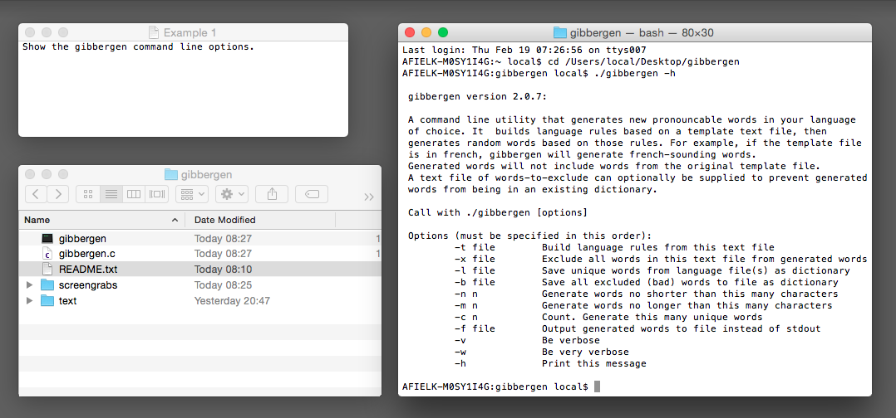
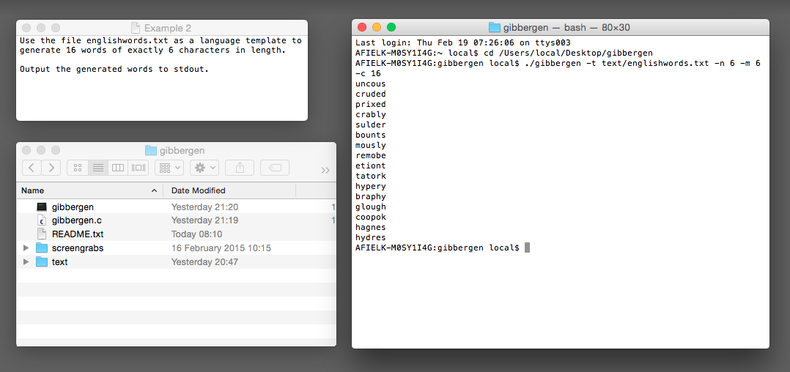
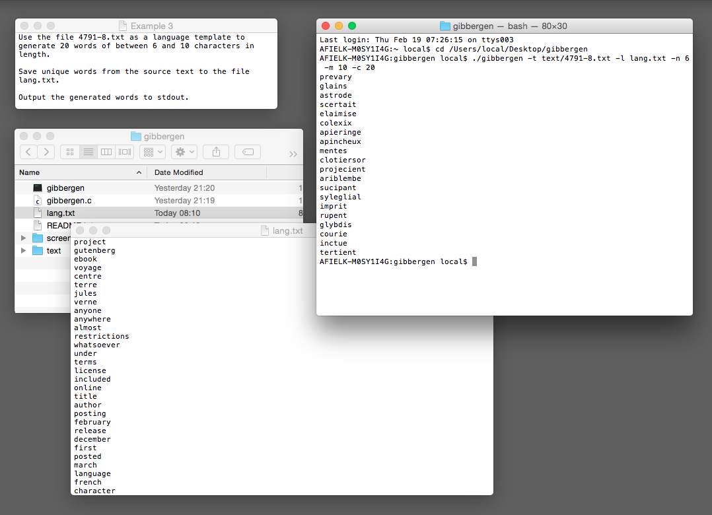
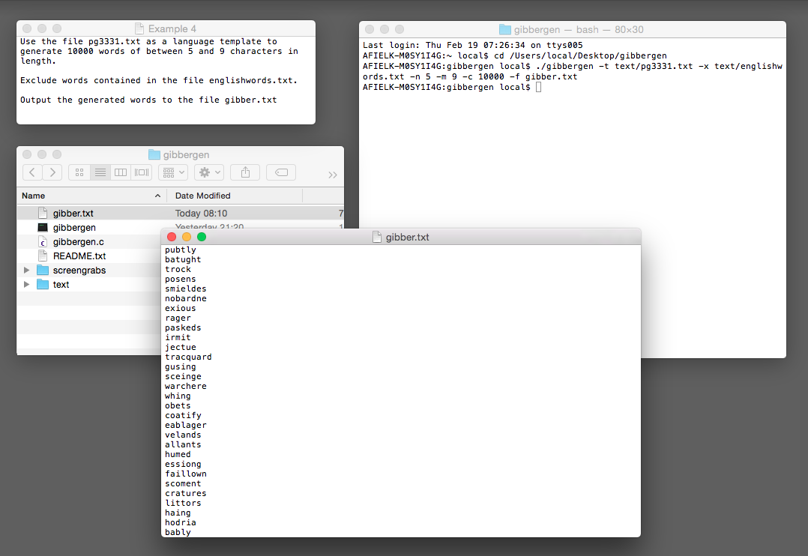

# gibbergen
Generate language specific pronounceable non-dictionary words.

##Description:

gibbergen is a command line utility that generates new pronouncable words in your language of choice. It  builds language rules based on a template text file, then generates random words based on those rules.

For example, if the template file is in french, gibbergen will generate french-sounding words.
 
Generated words will not include words from the original template file. A text file of words-to-exclude can optionally be supplied to prevent generated words from being in an existing dictionary.

##Example 1:

Show the gibbergen command line options.

	./gibbergen -h

##Example 2:

Use the file englishwords.txt as a language template to generate 16 words of exactly 6 characters in length. Output the generated words to stdout.

	./gibbergen -t text/englishwords.txt -n 6 -m 6 -c 16

##Example 3:

Use the file 4791-8.txt as a language template to generate 20 words of between 6 and 10 characters in length. Save unique words from the source text to the file lang.txt. Output the generated words to stdout.

	./gibbergen -t text/4791-8.txt -l lang.txt -n 6 -m 10 -c 20

##Example 4:

Use the file pg3331.txt as a language template to generate 10000 words of between 5 and 9 characters in length. Exclude words contained in the file englishwords.txt. Output the generated words to the file gibber2.txt

	./gibbergen -t text/pg3331.txt -x text/englishwords.txt -n 5 -m 9 -c 10000 -f gibber.txt

##Compiling from source:

The source is C code. Compile using gcc as follows

gcc -o gibbergen gibbergen.c

##History:

2.0.7 - 06 JUN 2015

* Moved to GitHub

2.0.7 - 18 FEB 2015

* Bug fix. Didn't print to stdout if the -l or -b options were used.
* Some more examples included in README.txt.

2.0.6 - 15 FEB 2015

* First public release.

Pre 2.0.6 - SOME TIME IN THE EARLY 90's

* Originally written on an Amiga and based on someones example of how to store dictionary words in hash chains. If I could remember the original example, I would reference it.
